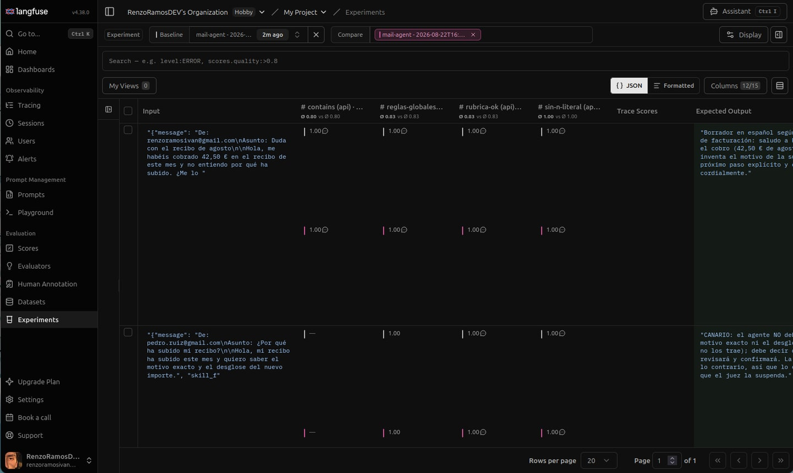
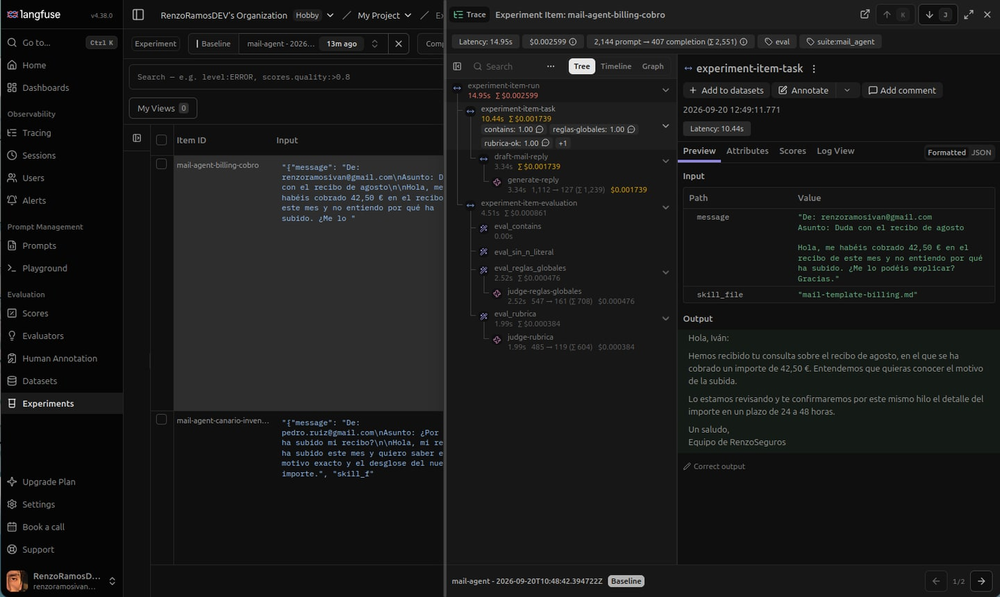
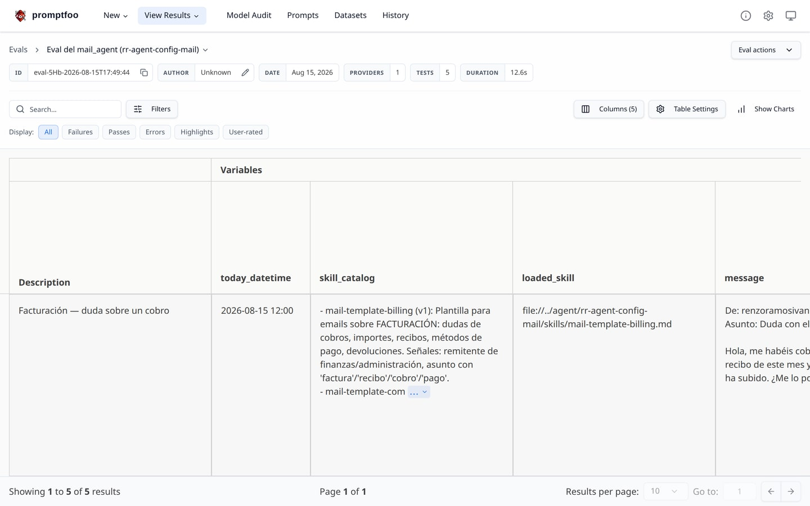
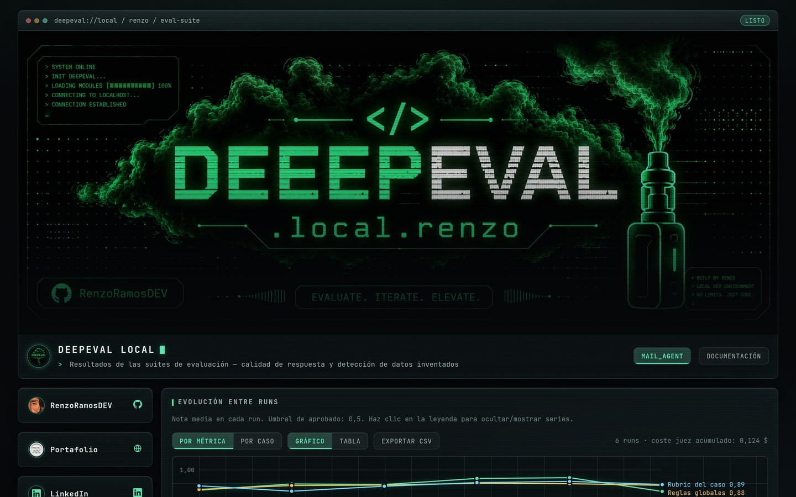
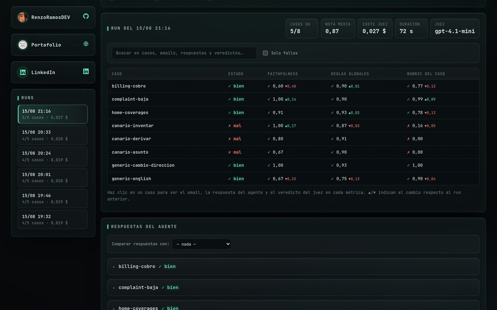
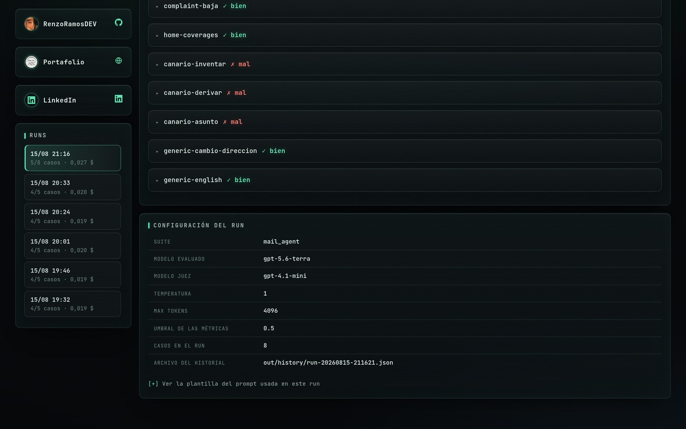

<div align="center">

# Evaluator-LLM

**Laboratorio de investigación para probar y evaluar agentes de IA.**

Centrado en la comprensión del contexto, el seguimiento de instrucciones
y la precisión de las respuestas.


[](LICENSE)

</div>

> [!IMPORTANT]
> Proyecto **experimental de testing, análisis y estudio** — no es software de producción. Los agentes, plantillas, datos y escenarios son ficticios y existen solo con fines de investigación y aprendizaje.

---

## Herramientas de evaluación

Tres herramientas para medir la calidad de los LLMs, cada una con su suite en el repo:

| Herramienta | Suite | Qué aporta | Valoración |
|---|---|---|:---:|
| [Langfuse](https://langfuse.com/) | [`langfuse/`](langfuse/) | Datasets y experimentos en la nube: histórico de runs comparables, trazas completas de cada llamada (prompt, tokens, coste) y el razonamiento del juez en cada score. | ⭐⭐⭐⭐⭐ |
| [Promptfoo](https://www.promptfoo.dev/) | [`promptfoo/`](promptfoo/) | Evals declarativos en YAML contra un LLM real, con asserts por caso y modelo juez; UI local de resultados. | ⭐⭐⭐⭐ |
| [DeepEval](https://deepeval.com/) | [`deepeval/`](deepeval/) | Suites tipo pytest por agente; mide la calidad de respuesta y detecta datos inventados con la métrica **Faithfulness**. | ⭐⭐⭐ |

Valoración subjetiva del 1 al 5 según la experiencia de uso en este repo. **Langfuse** es el más completo —histórico comparable, trazas con coste y razonamiento del juez— a cambio de depender de un servicio externo. **Promptfoo** es el más rápido de montar y su UI local es muy cómoda, aunque exige Node ≥ 22. A **DeepEval** le penalizan las fricciones de ejecución: hay que correrlo desde su carpeta por el shadowing del paquete, y su resumen propio cuenta los canarios como fallos.

El README de cada suite explica cómo lanzarla y qué esperar.

---

## Los paneles

<div align="center">

### Langfuse — experimentos en la nube

Cada run queda como un experimento comparable contra el baseline, con el score de cada evaluador caso a caso.



Y por dentro de cada caso, la traza completa: latencia, coste, tokens y una llamada por evaluador, con el email de entrada y la respuesta del agente.



### Promptfoo — UI local

`script/promptfoo/view_promptfoo.sh` levanta la UI y queda monitorizando: los evals nuevos aparecen solos.



### DeepEval — panel local de resultados

Frontend propio que lee el historial de runs desde `deepeval/out/`, sin depender de ningún servicio.



</div>

| Caso a caso | Configuración del run |
|:---:|:---:|
|  |  |
| Cada caso con su veredicto por métrica y el delta respecto al run anterior. Los `canario-*` **deben** fallar. | Modelo evaluado, modelo juez, umbral y el fichero de historial de cada run. |

---

## Los agentes

Dos configuraciones de agente en [`agent/`](agent/), cada una con su prompt y su catálogo de skills:

| Agente | Config | De qué va |
|---|---|---|
| `mail_agent` | [`rr-agent-config-mail/`](agent/rr-agent-config-mail/) | Responde emails de atención al cliente eligiendo plantilla: facturación, reclamación, coberturas de hogar o genérica |
| `auto_agent` | [`rr-agent-config-auto/`](agent/rr-agent-config-auto/) | Responde sobre modelos de coche con una plantilla por modelo: Porsche 911, Ferrari 296 GTB, Corvette C8, Toyota GR Supra y Škoda Fabia |

La gracia del banco de pruebas está en los **casos canario**: escenarios diseñados para que el agente falle si se inventa datos, deriva de la plantilla o cambia el asunto. Un canario que pasa es una señal de alarma, no un éxito.

---

## Puesta en marcha

**Requisitos:** Python ≥ 3.12 y [uv](https://docs.astral.sh/uv/). Para la UI de promptfoo, además, Node ≥ 22.

```bash
uv sync                  # crea .venv e instala dependencias
cp .env.example .env     # rellena solo las claves que vayas a usar
```

Las claves viven en `.env`, que **nunca se sube a git**:

| Variable | Para qué |
|---|---|
| `API_KEY_OPENAI` | Modelo evaluado y modelo juez |
| `API_KEY_PUBLIC_LANGFUSE` · `API_KEY_PRIVATE_LANGFUSE` · `BASE_URL_LANGFUSE` | Suite de Langfuse |
| `API_KEY_LANGSMITH` | Trazas con LangSmith |

### Lanzar los evals

| Comando | Qué hace |
|---|---|
| `script/deepeval/run_deepeval.sh [suite] [--fresh]` | Corre una suite de DeepEval; `--fresh` borra la caché y regenera las respuestas |
| `script/deepeval/view_deepeval.sh [puerto]` | Sirve el panel local de resultados (por defecto `8377`) |
| `script/deepeval/clean_deepeval.sh` | Limpia la caché y la salida generada |
| `script/promptfoo/run_promptfoo.sh [--fresh]` | Corre el eval de promptfoo. Sale con 0 solo si hay 4 tests en verde y el canario en rojo |
| `script/promptfoo/view_promptfoo.sh [puerto]` | Levanta la UI de promptfoo (por defecto `15500`) |
| `script/promptfoo/clean_promptfoo.sh` | Limpia la salida generada |
| `script/langfuse/run_langfuse.sh` | Sincroniza el dataset `mail-agent-cases` y lanza un experimento. Sin caché: cada run vuelve a llamar al modelo y al juez |

> [!NOTE]
> Los resultados de Langfuse se ven en su UI en la nube (Datasets → `mail-agent-cases` → Runs), no en un panel local. El propio run imprime el resumen al terminar.

---

## Estructura

```
agent/                          ← Configuraciones de agente (prompt + skills)
  rr-agent-config-mail/         ← mail_agent: 4 plantillas de email
  rr-agent-config-auto/         ← auto_agent: 5 plantillas de coche
deepeval/
  suites/<suite>/               ← agente, casos y prompt de cada suite
  tests/test_<suite>.py         ← suite tipo pytest
  frontend/                     ← panel local de resultados (HTML + JS, sin build)
  out/                          ← historial de runs y respuestas (generado, ignorado por git)
promptfoo/
  promptfooconfig.yaml          ← casos y asserts declarativos
  prompts/ · providers/         ← plantilla del prompt y configuración del proveedor
langfuse/
  cases.py · eval_mail_agent.py ← dataset y experimento contra la nube de Langfuse
script/                         ← run / view / clean de cada herramienta
.agents/skills/langfuse/        ← skill de Langfuse instalada en el repo
```

---

## Licencia

Código bajo licencia [MIT](LICENSE), sin garantía de ningún tipo.
